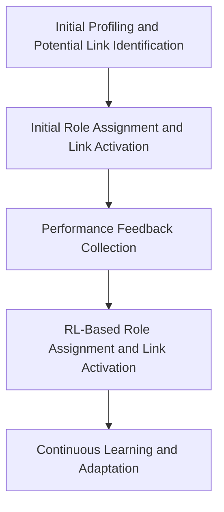

# Reinforcement Learning-Based Role Assignment and Link Activation in BLE Mesh MCU Network

### Pipeline for RL-Based Role Assignment and Link Activation in BLE Mesh MCU Network

#### 1. Initial Profiling and Potential Link Identification
- **Objective**: Gather initial data about node capabilities and potential communication paths.
- **Activities**:
  - Measure CPU speed, memory capacity, battery capacity, and signal strength for each node.
  - Determine physical distances and signal strengths between pairs of nodes.
  - Create a graph of potential links based on connectivity criteria.
- **Outcome**: Comprehensive profiles of each node and a graph of potential links.

#### 2. Initial Role Assignment and Link Activation
- **Objective**: Assign preliminary roles to nodes and establish initial active links.
- **Activities**:
  - Use heuristics or initial policies to assign roles (e.g., sensor, processing, aggregation, relay).
  - Determine initial active links based on these preliminary roles.
- **Outcome**: Initial role assignments and active links set up for initial network operation.

#### 3. Performance Feedback Collection
- **Objective**: Collect performance metrics from the network to provide feedback for the RL agent.
- **Activities**:
  - Deploy initial role assignments and active links.
  - Measure key performance metrics such as data throughput, latency, energy consumption, and model accuracy.
- **Outcome**: Performance data collected for RL training.

#### 4. RL-Based Role Assignment and Link Activation
- **Objective**: Refine roles and active links using RL to optimize network performance.
- **Activities**:
  - The RL agent receives the current state, including node capabilities, roles, potential links, and performance metrics.
  - The RL agent selects an action that includes new role assignments and new active links.
  - Implement the action in the network.
- **Outcome**: Improved role assignments and active links based on RL optimization.

#### 5. Continuous Learning and Adaptation
- **Objective**: Continuously improve role assignments and link activation through ongoing RL training.
- **Activities**:
  - Collect ongoing performance feedback from the network.
  - Update Q-values and refine the RL policy based on the feedback.
  - Adjust roles and active links dynamically to adapt to changing network conditions.
- **Outcome**: A continuously optimized network with dynamic role assignments and active links.

### Summary of Streamlined Pipeline

1. **Initial Profiling and Potential Link Identification**
   - Gather node capabilities and potential communication paths.

2. **Initial Role Assignment and Link Activation**
   - Assign preliminary roles and determine initial active links.

3. **Performance Feedback Collection**
   - Deploy initial setup and collect performance metrics.

4. **RL-Based Role Assignment and Link Activation**
   - Use RL to refine roles and active links for optimal performance.

5. **Continuous Learning and Adaptation**
   - Collect ongoing feedback, update RL policy, and dynamically adjust roles and links.

This streamlined pipeline ensures an efficient and adaptive approach to role assignment and link activation in a BLE mesh MCU network, leveraging RL to optimize network performance continuously.

# Mathematical Formulation for RL-Based Role Assignment and Link Activation

#### Key Components

1. **State Space ($S$)**: Represents the current status of the network.
   - $S_t$ at time $t$ includes node capabilities, current role assignments, potential communication links, and link statuses (active/inactive).
   - Example: $S_t = \{ (A, \text{CPU: 1.2 GHz, RAM: 256 MB, Battery: 3000 mAh, Roles: [Processing]}), (B, \text{CPU: 0.8 GHz, RAM: 128 MB, Battery: 2000 mAh, Roles: [Sensor]}), \ldots \}$

2. **Action Space ($A$)**: Represents possible role assignments and link activation/deactivation decisions.
   - $A_t$ at time $t$ includes assigning roles (single or multiple) to nodes and determining which links to activate or deactivate.
   - Example: $A_t = \{ (\text{Node A: [Processing, Relay], Node B: [Sensor], Node C: [Aggregation]}), (\text{Activate: A-B, Deactivate: A-C, Activate: B-C}) \}$

3. **Reward Function ($R$)**: Provides feedback on the performance of the network.
   - $R_t$ at time $t$ is a function of throughput ($T$), latency ($L$), energy consumption ($E$), model accuracy ($A$), and communication failures ($\text{Failures}$).
   - Example: $R_t = \alpha T - \beta L - \gamma E + \delta A - \epsilon \text{Failures}$

4. **Policy ($\pi$)**: The strategy used by the RL agent to select actions based on the current state.
   - The policy can be deterministic or stochastic.

5. **Q-Value ($Q$)**: The expected cumulative reward of taking action $A$ in state $S$.

### Formulation

1. **State Transition**:
   - The environment transitions from state $S_t$ to $S_{t+1}$ based on the action $A_t$ taken by the RL agent.
   - $S_{t+1} = f(S_t, A_t)$

2. **Reward Calculation**:
   - The reward $R_t$ is calculated based on the performance metrics.
   - $R_t = \alpha T - \beta L - \gamma E + \delta A - \epsilon \text{Failures}$

3. **Q-Learning Update**:
   - The Q-value for state-action pair $(S_t, A_t)$ is updated using the Q-learning rule:
     $$
     Q(S_t, A_t) \leftarrow Q(S_t, A_t) + \alpha \left[R_t + \gamma \max_{A'} Q(S_{t+1}, A') - Q(S_t, A_t)\right]
     $$
   - Where:
     - $\alpha$ is the learning rate.
     - $\gamma$ is the discount factor.
     - $\max_{A'} Q(S_{t+1}, A')$ is the maximum expected future reward for the next state $S_{t+1}$.

4. **Policy Update**:
   - The policy $\pi$ is updated to select actions that maximize the Q-value.
   - $\pi(S_t) = \arg\max_A Q(S_t, A)$

### Example Workflow

1. **Initialization**:
   - State $S_0$ is initialized with profiling data and potential links.
   - Example: $S_0 = \{ (A, \text{CPU: 1.2 GHz, RAM: 256 MB, Battery: 3000 mAh, Roles: []}), (B, \text{CPU: 0.8 GHz, RAM: 128 MB, Battery: 2000 mAh, Roles: []}) \}$

2. **Action Selection (Epsilon-Greedy)**:
   - With probability $\epsilon$, select a random action.
   - With probability $1 - \epsilon$, select the action that maximizes $Q(S_t, A_t)$.

3. **Environment Interaction**:
   - Apply action $A_t$ (e.g., assign roles and activate/deactivate links).
   - Observe new state $S_{t+1}$ and reward $R_t$.

4. **Q-Value Update**:
   - Update $Q(S_t, A_t)$ using the observed reward and next state.

5. **Policy Update**:
   - Update policy $\pi$ based on updated Q-values.

6. **Iteration**:
   - Repeat for many episodes to learn the optimal policy.

### Role Assignment and Link Activation/Deactivation

1. **Role Assignment**:
   - Each node can be assigned one or multiple roles.
   - Example: Node A can be both a Processing and a Relay node.

2. **Link Activation/Deactivation**:
   - Determine which links to activate or deactivate based on roles and current network state.
   - Example: Activate link A-B for direct communication, deactivate link A-C if routing through B is more efficient.

### Summary

The RL process for role assignment and link activation/deactivation in a BLE mesh MCU network involves defining the state space, action space, reward function, and policy. The Q-learning algorithm updates Q-values and policies based on performance feedback, optimizing role assignments and communication paths dynamically. This approach ensures an efficient, adaptive network that continuously improves performance by considering both the roles of nodes and the activation status of links.

## Insights on Using Reinforcement Learning for Role Assignment and Link Activation in BLE Mesh MCU Networks

BLE mesh networks operate in dynamic environments where node capabilities, network topology, and communication conditions can change frequently. Traditional static or heuristic-based methods may not adapt well to these changes.