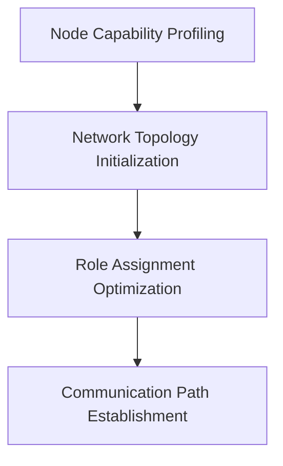

### Network Design Pipeline

### Explanation of Each Component in the Network Design Pipeline

#### 1. Node Capability Profiling
- **Objective**: Assess the individual capabilities of each node within the network.
- **Activities**:
  - Measure key attributes such as CPU speed, memory capacity, battery life, and signal strength for each node.
  - Collect and compile this data to create a comprehensive profile of each node’s capabilities.
- **Outcome**: Detailed profiles of all nodes, highlighting their computational, storage, energy, and communication capabilities.

#### 2. Network Topology Initialization
- **Objective**: Gather initial information about the network’s physical and logical structure.
- **Activities**:
  - Determine the physical distances between each pair of nodes.
  - Assess potential communication links based on signal strength and distance metrics.
  - Construct an initial network topology graph representing nodes and potential communication paths.
- **Outcome**: An initial network topology graph that outlines the physical layout and potential communication links between nodes.

#### 3. Role Assignment Optimization
- **Objective**: Assign optimal roles to each node based on their capabilities and the network topology.
- **Activities**:
  - Analyze the profiling data and network topology to determine the most suitable roles for each node (e.g., sensor, processing, aggregation, relay).
  - Ensure a balanced distribution of roles across the network to optimize performance and resource utilization.
  - Identify and assign multiple roles to critical nodes if necessary, to enhance network efficiency and resilience.
- **Outcome**: Optimally assigned roles for each node, ensuring efficient operation and resource utilization within the network.

#### 4. Communication Path Establishment
- **Objective**: Define and establish initial communication paths between nodes based on the network topology and assigned roles.
- **Activities**:
  - Design communication paths that facilitate efficient data flow between nodes, considering their roles and distances.
  - Ensure redundancy and fault tolerance by incorporating multiple communication paths where necessary.
  - Update the network topology graph to include established communication paths, reflecting the final network design.
- **Outcome**: A finalized network topology with established communication paths, ensuring reliable and efficient data transmission across the network.
